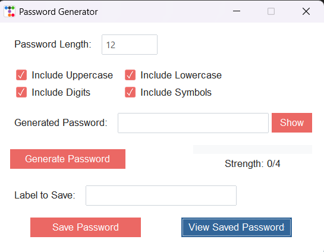

# 🔐 Secure Password Generator

 

A professional-grade password management tool with GUI, featuring military-grade encryption and intelligent strength analysis. Built with Python and TtkBootstrap for modern security applications.

## ✨ Key Features

### 🔑 Password Generation
- **Customizable Complexity**:
  - Uppercase (A-Z) and lowercase (a-z) letters
  - Numbers (0-9) and special symbols (!@#$%^&*)
  - Adjustable length (1-72 characters)
- **Cryptographically Secure**:
  - Uses Python's `secrets` module (CSPRNG)
  - Guaranteed uniform character distribution
  - No predictable patterns

### 🛡️ Security Features
- **Real-time Strength Analysis**:
  - zxcvbn algorithm (Dropbox's password estimator)
  - 0-4 scoring system with detailed feedback
  - Color-coded visual meter (red/yellow/green)
- **Secure Storage**:
  - AES-256 encrypted password vault
  - Separate key file management
  - Memory-safe handling

### 💻 User Experience
- **Modern GUI**:
  - TtkBootstrap theming (Journal theme)
  - Responsive layout
  - Password visibility toggle
- **Efficient Workflow**:
  - Auto-copy to clipboard
  - Label-based organization
  - Tabular password viewer
- **Cross-platform**:
  - Works on Windows, macOS, and Linux

## 📦 Installation

### Prerequisites
- Python 3.8+
- pip package manager

### Setup
1. Clone the repository:
   ```bash
   git clone https://github.com/migueloomar/Password-Generator.git
   cd password-generator